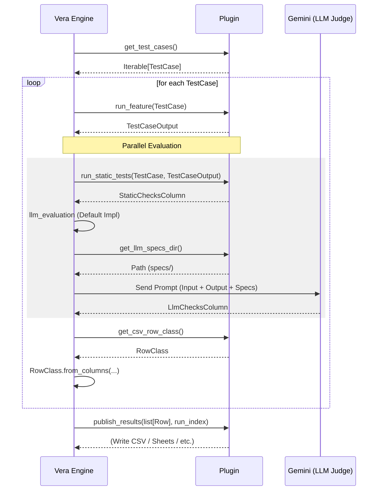

# Plugin Development Guide

Vera uses a plugin-based architecture powered by [pluggy](https://pluggy.readthedocs.io/). This
allows you to easily add support for new AI features by implementing a set of hooks.

## Plugin Architecture

The following diagram illustrates the interaction between the Vera Engine and a Plugin during an
test run:



## Creating Your First Plugin

The easiest way to start is using the `vera create` command:

```shell
vera create --name my_awesome_feature --description "Evaluates a creative writing assistant"
```

This scaffolds a project with the following structure:

```text
my_awesome_feature/
├── pyproject.toml              # Entry point definition
├── src/
│   └── my_awesome_feature/
│       ├── plugin_impl.py      # Hook implementations
│       ├── core/
│       │   └── data_models.py  # Pydantic models for your data
│       └── feature_tests/
│           ├── test_cases.yaml # Your test dataset
│           ├── resources/      # Context files (PDFs, text, etc.)
│           └── specs/          # Markdown rubrics and constraints
└── tests/                      # Unit tests for your plugin
```

## Key Hooks to Implement

To create a functional plugin, you typically implement these hooks in `plugin_impl.py`:

1. **`get_test_cases()`**: Loads your test cases (usually from `test_cases.yaml`).
2. **`run_feature(test_case, resources_dir)`**: This is where you call your actual AI feature. It
   should return a `TestCaseOutput`.
3. **`run_static_tests(test_case, test_output)`**: Implement programmatic checks here
   (e.g., "does the response contain a valid JSON?").
4. **`get_csv_row_class()`**: Returns the Pydantic class used for a single row in the final report.
5. **`get_llm_specs_dir()`**: Tells Vera where your Markdown specifications are located.
6. **`publish_results(rows, run_index)`**: Called after testing to save results.

## Advanced Extensibility

Vera allows plugins to extend the CLI and the global configuration.

### Extending CLI Parameters

You can add custom CLI parameters to existing commands using the following hooks:

- **`display_test_command_help(extra_args: list[str]) -> bool`**: Called to display help for `eval`.
- **`handle_test_command_extra_args(extra_args: list[str])`**: Called to parse `eval` arguments.
- **`display_config_command_help(extra_args: list[str]) -> bool`**: Called to display help for
  `config`.
- **`handle_config_command_extra_args(config: VeraConfig, extra_args: list[str])`**: Called to parse
  `config` arguments.

**Important Requirements:**

1. **Separation of Concerns:** One hook is responsible for displaying help, while the other handles
   the actual parameter parsing and consumption.
2. **Modify in place:** Your `handle_..._extra_args` implementation **must** remove the arguments it
   recognizes from the
   `extra_args` list. This allows Vera to detect unknown/unregistered options.
3. **Help signal:** Your `display_..._help` implementation should check if its specific help flag (
   e.g., `--my-plugin-help`) is present in `extra_args`, print the help message, remove the flag,
   and return `True`.

Example using `argparse`:

```python
def get_parser():
    parser = argparse.ArgumentParser(description="My Plugin Options", add_help=False)
    parser.add_argument("--my-option", help="Custom plugin option")
    return parser


@vera.hook_impl
def display_test_command_help(extra_args: list[str]) -> bool:
    if "--my-help" in extra_args:
        get_parser().print_help()
        extra_args.remove("--my-help")
        return True
    return False


@vera.hook_impl
def handle_test_command_extra_args(extra_args: list[str]) -> None:
    args, remaining = get_parser().parse_known_args(extra_args)
    extra_args[:] = remaining  # Update the list in place
    # Use args.my_option...
```

### Adding New Commands

Use the **`extend_cli(app: typer.Typer)`** hook to add entirely new commands or subcommands.

```python
@vera.hook_impl
def extend_cli(app):
    @app.command()
    def my_custom_command():
        print("Hello from plugin!")
```

### Extending Configuration

The `VeraConfig` object allows arbitrary extra fields. You can use the *
*`update_config(config: VeraConfig)`** hook to set default values for your plugin-specific
configuration.

```python
@vera.hook_impl
def update_config(config):
    if not hasattr(config, "my_plugin_setting"):
        config.my_plugin_setting = "default_value"
```

These settings will be saved to the `config.yaml` file when `vera config` is run.

## Code Example: Simple Feature

Here is a simplified example of what `plugin_impl.py` looks like:

```python
import vera
from .core.data_models import MyInput, MyOutput, MyRow, MyStaticColumn


@vera.hook_impl
async def run_feature(test_case, resources_dir):
    # Call your LLM, API, or function here
    result = await my_ai_feature_call(test_case.input.query)
    return MyOutput(response=result)


@vera.hook_impl
def run_static_tests(test_case, test_output):
    # Programmatic check
    is_valid = "hello" in test_output.response.lower()
    return MyStaticColumn(greeting_present=is_valid)
```

## Reference Implementation

For a complete, working example, see
the [SQL Query Assistant](/plugin_example/sql_query_assistant/README.md) in the
`plugin_example/`
directory. It demonstrates complex data models, custom scoring, and resource management.
